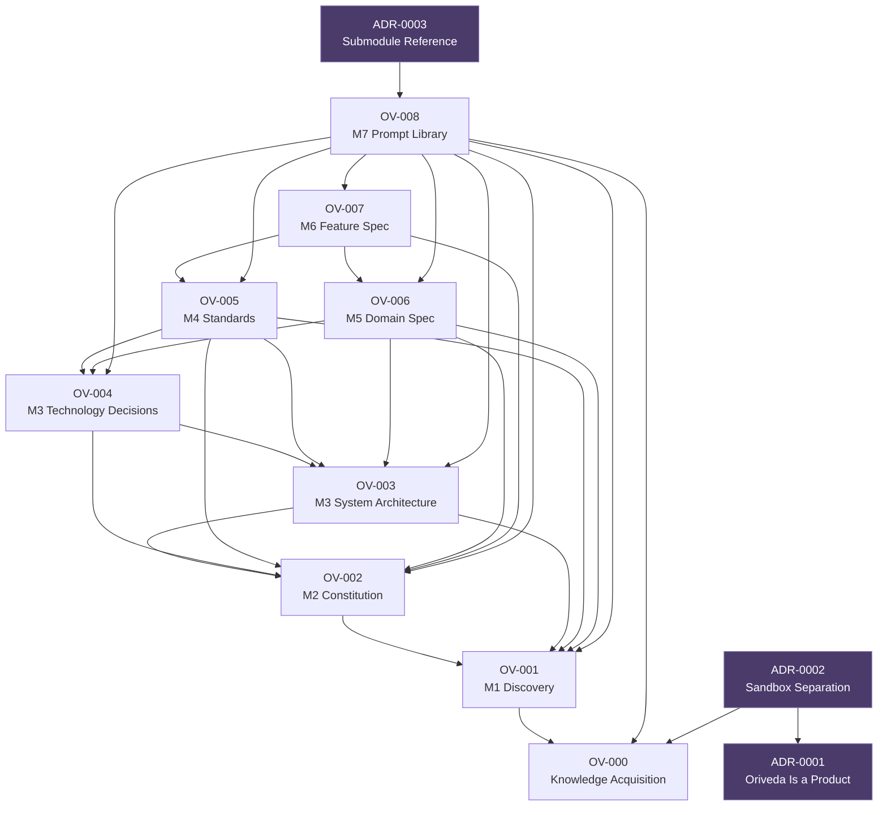

# Oriveda Knowledge Graph

Rendered from every Frozen specification's own frontmatter
(`depends_on`/`required_by`/`related_decisions`) — this file is a
**view**, not a second source of truth. If it ever disagrees with a
spec's frontmatter, the frontmatter wins; fix this file to match, not the
other way around.

**Maintenance:** update this diagram by hand at each milestone
checkpoint, alongside `.oriveda/manifest.yaml` — same discipline, same
moment, not a separate pass. There are only ~12 nodes today; this stays
cheap to keep current as long as it's done at the same time a new
protocol or ADR gets frozen, not batched up later.

An arrow `A --> B` means **A depends on B** (B is a prerequisite of A).

## Reading this graph

- **The spine (`OV-000` → `OV-008`) is almost entirely linear** by
  design — each milestone's protocol depends on the ones before it. The
  one branch is `OV-003`/`OV-004` (Architecture splits into two sibling
  documents, per the M3 scoping decision) which both feed `OV-005`,
  `OV-006`, and `OV-008`.
- **`OV-007`does not depend on `OV-003`/`OV-004` directly** — it reaches
  architecture-level context only through `OV-006` (Domain
  Specifications), which already absorbed and restated what `OV-007`
  needs. This is the "point, don't copy" discipline visible structurally:
  `OV-007` doesn't re-depend on something a closer layer already covers.
- **`ADR-0002` depends on `ADR-0001`** — fixed as part of this audit; the
  frontmatter previously claimed this relationship one-directionally
  (`ADR-0001` listed `ADR-0002` as `required_by` without the reverse
  `depends_on` existing), which this graph would have silently rendered
  wrong had it been built before the fix.
